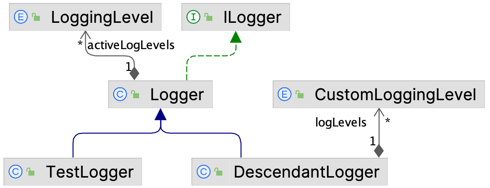
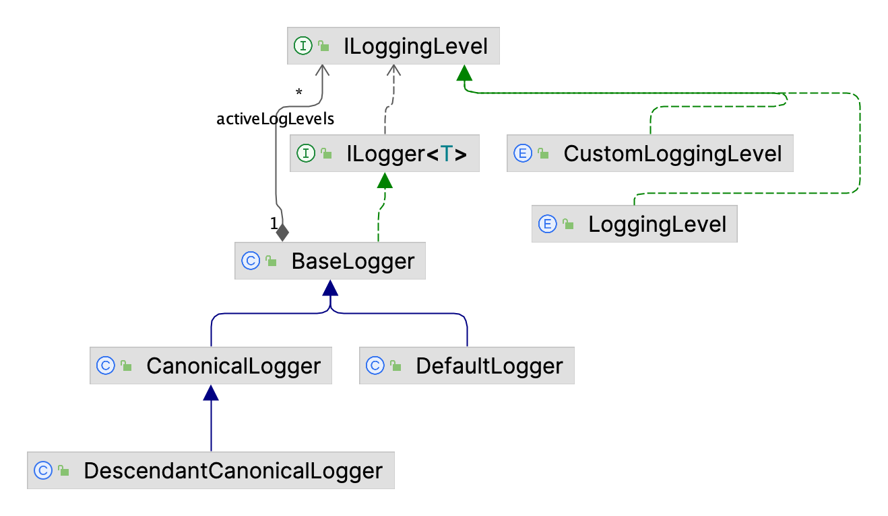
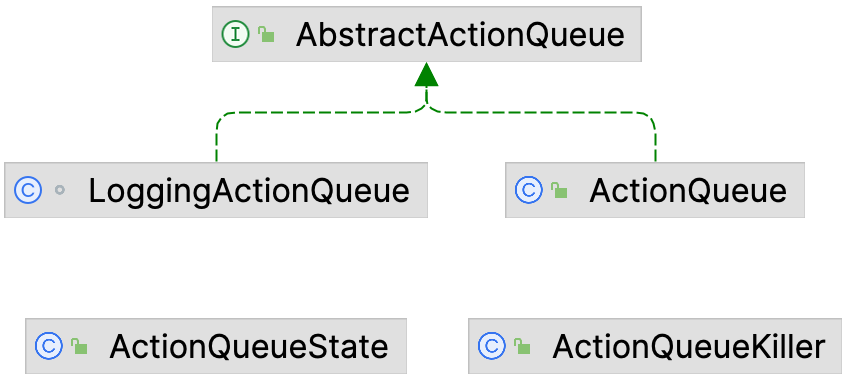
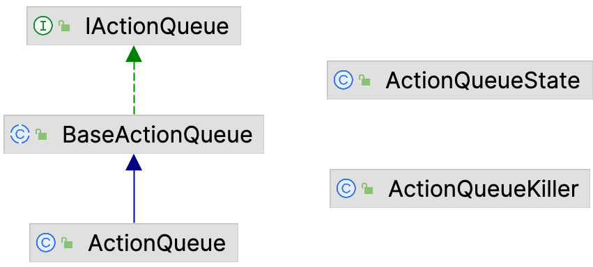

- [<span class="toc-section-number">1</span> Introduction](#introduction)
  - [<span class="toc-section-number">1.1</span> Project selection](#project-selection)
  - [<span class="toc-section-number">1.2</span> High-level overview of the project structure](#high-level-overview-of-the-project-structure)
  - [<span class="toc-section-number">1.3</span> Additional tools and resources](#additional-tools-and-resources)
  - [<span class="toc-section-number">1.4</span> Building the project](#building-the-project)
- [<span class="toc-section-number">2</span> Project health analysis](#project-health-analysis)
  - [<span class="toc-section-number">2.1</span> Static code analysis results](#static-code-analysis-results)
    - [<span class="toc-section-number">2.1.1</span> Large class detection](#large-class-detection)
    - [<span class="toc-section-number">2.1.2</span> Code duplication and inheritance misuse](#code-duplication-and-inheritance-misuse)
    - [<span class="toc-section-number">2.1.3</span> SonarQube analysis](#sonarqube-analysis)
    - [<span class="toc-section-number">2.1.4</span> Pattern4j analysis](#pattern4j-analysis)
    - [<span class="toc-section-number">2.1.5</span> Codebase structural problems](#codebase-structural-problems)
  - [<span class="toc-section-number">2.2</span> Refactoring Goals and Planning](#refactoring-goals-and-planning)
- [<span class="toc-section-number">3</span> Refactoring process](#refactoring-process)
  - [<span class="toc-section-number">3.1</span> `logging` package refactoring](#logging-package-refactoring)
  - [<span class="toc-section-number">3.2</span> Exception classes refactoring](#exception-classes-refactoring)
  - [<span class="toc-section-number">3.3</span> `queue` package refactoring](#queue-package-refactoring)
- [<span class="toc-section-number">4</span> Results and discussion](#results-and-discussion)
  - [<span class="toc-section-number">4.1</span> Results](#results)
  - [<span class="toc-section-number">4.2</span> Missing refactoring opportunities and Conclusions](#missing-refactoring-opportunities-and-conclusions)

# Introduction

This assignment requires the use of the knowledge acquired during the course, in order to refactor an existing open-source project, aiming to improve its design. The behavior of the project should remain unchanged, as well as its input and output interfaces.

The refactoring should target at least 1000 lines of code, and the changes should be documented in a report, and pushed to a separate branch in the project’s repository, allowing an easy comparison between the original and the new, improved version. To find valuable candidates for this assignment, the GitHub search feature was used, filtering the results by language, Java, and the number of stars, between 100 and 1000. The search results were sorted by last update date, in descending order in order to find active projects.

Additionally, each selected project size was analyzed with the web application [Count LOC](https://codetabs.com/count-loc/count-loc-online.html), in order to count the total lines of code (later referred as _LOC_) that would be affected by the refactor (considering only source code, excluding tests or other utilities).

## Project selection

As cited before, in order to accomplish the personal objective set at the beginning of this assignment, the search targeted project with a high number of stars, between 100 and 1000, and written in Java language in order to leverage the knowledge acquired during the course. The search results were sorted by the last update date, in descending order, to find active projects. After an in-depth analysis of results, these are the possible candidates selected for further investigation:

- [fanglet/kanzi](https://github.com/flanglet/kanzi): Kanzi is a modern, modular and efficient lossless data compressor implemented entirely in java. It uses state-of-the art entropy coders and multi-threading in order to efficiently utilize multi-core CPUs. The design of the library is modular, allowing to select at runtime the best entropy coder for the data to compress. The project has 109 stars, 18 forks, no open issues, and approximately 20,000 LOC. Kanzi was initially selected for this assignment, but later discarded due to its size.

- [jinput/jinput](https://github.com/jinput/jinput): JInput is a Java library designed for accessing input devices such as game controllers, joysticks, and other peripherals. It provides a platform-independent API to facilitate the integration of various input devices into Java applications. The project has 150 stars, 79 forks, 29 open issues, and 10,000 lines of code (considering only core functionality, excluding tests). JInput was initially selected for this assignment, but unfortunately, after inspecting the codebase it was discarded as the project presented too many platform-specific implementations spanning multiple modules and a complete lack of documentation and tests. This would make the refactoring process too complex and time-consuming.

- [byronka/minum](https://github.com/byronka/minum): Minum is a minimalistic web framework written in Java, built from scratch using few dependencies. The project provides essential components for web application development, including a web server and an in-memory database with disk persistence. This project was particularly interesting as it emphasizes simplicity and minimalism, which is a good starting point for refactoring as most of the code is written from scratch without complex dependencies. Minum has 611 stars, 38 forks, no open issues, and approximately 5’500 LOC (excluding tests and comments). After a thorough analysis, this project was selected for refactoring as it presents a clear and concise codebase divided into several packages, which will allow for a more focused refactor. Furthermore, it presents a complete JavaDoc documentation, which will be useful to understand the project’s design.

_Note_: The data presented above was collected on the , and may have changed since then. Check the project’s repository for the most recent information.

## High-level overview of the project structure

The project presents a single _Maven_ module which contains the core functionality of the framework. The module contains 10 packages, each with a specific purpose. The following list provides a high-level overview of the purpose of each package:

- `database`: In-memory database with disk persistence.

- `htmlparsing`: HTML parsing utilities.

- `logging`: Logging utilities.

- `queue`: Queue of tasks to be executed asynchronously.

- `security`: [Fail2Ban](https://github.com/fail2ban/fail2ban)-like security mechanism and threat detection via log analysis.

<!-- -->

- `state`: Singleton context to store global state.

- `templating`: Template engine to inject dynamic content into HTML pages.

- `testing`: Minimalistic testing framework for unit and integration tests.

- `utils`: General utilities.

- `web`: Web server and request handling.

From a first glance, the project seems well-structured, with clear separation of concerns between packages. As cited before, the codebase is well-documented, with JavaDoc comments present in most classes and methods, providing a good starting point to understand the project’s design. In <a href="#sec:project_health_analysis" data-reference-type="ref+label" data-reference="sec:project_health_analysis">2</a>, the project design will be analyzed in more detail, focusing on the use of design patterns and potential code smells.

## Additional tools and resources

In order to perform a comprehensive refactor of the project, the [SonarQube](https://www.sonarsource.com/) static code analysis tool will be used to identify potential code smells, bugs, and vulnerabilities, while also providing insights into the overall code quality. Additionally, in order to have a more in-depth understanding of the current design of the project, the [Pattern4j](https://users.encs.concordia.ca/~nikolaos/pattern_detection.html) tool will be used to detect the use of design patterns in the codebase, an essential aspect of the refactoring process.

The results of both tools provide valuable information to guide the refactor, highlighting areas of improvement and potential refactoring opportunities, and, by combining both outputs, will be possible to have a more comprehensive view of the project’s design and code quality.

## Building the project

The Minum project uses Maven as the build system, and in order to simplify the configuration process, the creator of the library created a Maven Wrapper script (named `mvnw`) which is a self-container script that allows to automatically download the necessary Maven version to build the project. This ensures that the build process is reproducible across different environments. This script is located in the root of the project, and can be used to build the project by running the following command:

<div class="center">

```bash
./mvnw clean install
```

</div>

_Note_: If the current environment already has Maven installed, the project can be built using the `mvn` command instead of the wrapper script.

The build artifacts can be found in the `target` directory. The bytecode generated by the build process will be used by the _Pattern4j_ tool to analyze the project’s design (refer to <a href="#sec:additional_tools" data-reference-type="ref+label" data-reference="sec:additional_tools">1.3</a>).

# Project health analysis

The project will be analyzed using both [SonarQube](https://www.sonarsource.com/) and _Pattern4j_ static code analysis tools, and also by custom-made shell scripts that collect interesting metrics about the codebase.

In the following section, the results of the analysis will be presented, highlighting potential code smells, bugs, vulnerabilities, and design patterns detected in the project.

As the configuration and usage of both tools is out of the scope of this report, the following sections will focus on the results of the analysis, providing insights into the current state of the project, and guiding the refactoring process. Refer to the respective documentation for more information on how to configure and use both tools.

## Static code analysis results

The following subsections will provide a summary of the results obtained from the static code analysis tools used in the project.

### Large class detection

In order to detect large classes, a custom bash script was developed to count the number of lines of code of each class in the project. The script uses the `cloc` tool to count the number of lines of code of each file in the project, and then orders the results by the number of lines of code in order to detect the largest classes. The following are the top 4 largest classes in the project (excluding test classes and comments):

1. `com.renomad.minum.web.WebFramework` - 415 LOC

2. `com.renomad.minum.htmlparsing.HtmlParser` - 372 LOC

3. `com.renomad.minum.database.` - 219 LOC

4. `com.renomad.minum.web.Response` - 214 LOC

The average number of lines of code is 55 LOC, which is considered acceptable. These classes represents a good starting point for refactoring, as they represent largest classes in the project.

### Code duplication and inheritance misuse

By manually analysing the codebase, was found that inside the `logging` and `queue` package there are multiple classes that share the same methods, which could be extracted into a common superclass in order to provide a more modular and maintainable codebase. Hence, these two classes also represent good candidates for refactoring.

### SonarQube analysis

After running the SonarQube analysis on the entire Minum codebase (including tests in order to get the test coverage metric), were detected a total of 588 code smells, 26 security hotspots and 34 possible bugs (which were later confirmed as false-positives as in the testing code). In the following paragraphs the results will be briefly analyzed in order to plan the refactoring process. <a href="#tab:sonarqube_severity_summary" data-reference-type="ref+label" data-reference="tab:sonarqube_severity_summary">4</a> provides a summary of the found code smells, categorized by severity.

<div id="tab:sonarqube_severity_summary">

<table>
<caption>SonarQube Severity Issues Summary</caption>
<thead>
<tr>
<th style="text-align: center;"><strong>Severity Type</strong></th>
<th style="text-align: left;"><strong>Issues</strong></th>
</tr>
</thead>
<tbody>
<tr>
<td style="text-align: center;"><strong>Critical</strong></td>
<td style="text-align: left;"><div id="tab:sonarqube_severity_summary">
<table>
<tbody>
<tr>
<td style="text-align: left;">design (90), suspicious (10), brain-overload (6) convention (1), multi-threading (1),</td>
</tr>
<tr>
<td style="text-align: left;">pitfall (1)</td>
</tr>
</tbody>
</table>
</div></td>
</tr>
<tr>
<td style="text-align: center;"><strong>Major</strong></td>
<td style="text-align: left;"><div id="tab:sonarqube_severity_summary">
<table>
<tbody>
<tr>
<td style="text-align: left;">cert (40), html5 (20), obsolete (19) bad-practice (17), owasp-a3 (17), cwe (16),</td>
</tr>
<tr>
<td style="text-align: left;">error-handling (15), pitfall (8), suspicious (7) accessibility (5), unused (4),</td>
</tr>
<tr>
<td style="text-align: left;">wcag2-a (4) confusing (2), design (2), brain-overload (1)</td>
</tr>
</tbody>
</table>
</div></td>
</tr>
<tr>
<td style="text-align: center;"><strong>Minor</strong></td>
<td style="text-align: left;"><div id="tab:sonarqube_severity_summary">
<table>
<tbody>
<tr>
<td style="text-align: left;">convention (374), cwe (7), java8 (5), brain-overload (4), pitfall (4), performance (2),</td>
</tr>
<tr>
<td style="text-align: left;">regex (2), unused (2), bad-practice (1), clumsy (1), suspicious (1)</td>
</tr>
</tbody>
</table>
</div></td>
</tr>
</tbody>
</table>

</div>

As shown in Table <a href="#tab:sonarqube_severity_summary" data-reference-type="ref" data-reference="tab:sonarqube_severity_summary">4</a>, the most common code smells in the project are related to Java conventions, design issues, CERT secure coding standards. Even if the focus of the refactoring process will be put on design issues, also the other code smells will be kept in consideration.

### Pattern4j analysis

Unfortunately, the pattern4j tool was not able to analyze the entire project codebase due to the use of Java 21 features in the project. By running the tool using the custom `run-pattern4j-headless.sh` script, the following error was raised:

    java.lang.IllegalArgumentException: Unsupported class file major version 65

For this reason, the design pattern usage analysis will be skipped. This is not a problem for the refactoring process, as it would have only provided additional insights into the design of the project rather than pinpointing specific issues.

### Codebase structural problems

As cited in <a href="#sec:project_structure" data-reference-type="ref+label" data-reference="sec:project_structure">1.2</a>, the project codebase is divided into 10 packages, each with a specific purpose. The overall structure of the codebase is showcase a very thorough organization, with each package containing a set of classes and interfaces related to a specific aspect of the library. However, by inspecting in more detail the structure of single packages three main issues were identified:

1. The framework defines many custom exceptions in order to handle specific errors. These exceptions are scattered across the codebase and are not properly organized. To address this issue, a new package should be created to contain all the custom exceptions, and the classes should be moved there.

2. Inside the `logging` package there are classes which are specific for testing purposes, which should be moved to the test package.

3. Inside the `util` package there are many self-contained utility classes that do not properly follow the single responsibility principle. Most of these classes contain multiple methods that are not related to each other, and should be split into multiple classes in order to improve the overall design of the project.

## Refactoring Goals and Planning

The main goal of the refactoring is to improve the maintainability and flexibility of the codebase, by removing duplicated code, improving the overall design and ensuring adherence to best practices.

As outlined in the previous sections, the Minum project presents several code smells and design issues that need to be addressed in order to improve the overall quality of the codebase. The refactoring will aim to solve the issues related to the `logging` package by providing an hierarchy of classes allowing to better manage the logging system of the library, and make it easily extendible in the future. Additionally, the testing classes present in the `logging` package will be moved to the relative test module in order to keep the codebase organized.

Furthermore, the custom exceptions will be moved to a new package in order to better organize the codebase and, to conclude, the code duplication problem that affects the `queue` will be addressed to provide a more maintainable and flexible solution.

# Refactoring process

In the following subsections, each step of the planned refactoring presented in <a href="#sec:refactoring_plan" data-reference-type="ref+label" data-reference="sec:refactoring_plan">2.2</a> will be detailed, providing insights into the previous state of the project, and the results achieved though the refactoring.

## `logging` package refactoring

Within this package, the `Logger` class supports four logging levels: `DEBUG`, `TRACE`, `AUDIT`, and `ASYNC_ERROR`, which are defined in the `LoggingLevel` `Enum`. To enhance flexibility, the library maintains the current state of these logging levels in a `HashMap`, where each entry is represented as a record `<LoggingLevel, Boolean>`. In this mapping, the key corresponds to a specific logging level as an `Enum`, and the value is a boolean indicating whether that level is enabled.

The library also includes a test example that demonstrates how to extend the built-in logger by defining a `DescendantLogger` class, which extends the `Logging` class in order to support a new set of logging levels encoded as the `CustomLoggingLevel` `Enum`. However, since there is no inheritance between `CustomLoggingLevel` and `LoggingLevel`, the library requires creating a separate `HashMap` to store the new logging levels. This approach results in code duplication, as the `DescendantLogger` class must reimplement all methods for managing logging levels, such as enabling/disabling levels, checking if a level is enabled, and logging messages at specific levels. This violates the DRY ([Don’t Repeat Yourself](https://en.wikipedia.org/wiki/Don%27t_repeat_yourself)) principle and increases the overall complexity of the codebase.

To address these design issues and create a more flexible and maintainable solution, a new abstract class, `BaseLogger`, was created. This class encapsulates the necessary data structures to manage any set of logging levels defined as `Enum` objects implementing the `ILoggingLevel` interface. This allows to store logging levels in a single `HashMap` regardless of their type, thus reducing code duplication and improving maintainability. Furthermore, a new generic interface, `ILogger<ILoggingLevel>`, was introduced. This interface includes a method `log(String, ILoggingLevel)`, which is implemented by the `BaseLogger` class to log messages at a specific logging level. This improved design is illustrated in <a href="#fig:refactored-logging" data-reference-type="ref+label" data-reference="fig:refactored-logging">2</a>.

<figure id="fig:original-logging">

<figcaption aria-hidden="true">Figure 1: Original <code>logging</code> package</figcaption>
</figure>

<figure id="fig:refactored-logging">

<figcaption aria-hidden="true">Figure 2: Refactored <code>logging</code> package</figcaption>
</figure>

By adopting this approach, developers can define custom logger classes by simply creating new logging levels in an `Enum` that extends the `ILoggingLevel` interface. Each custom logger will only need to implement specialized log methods for each logging level. This allows to create custom logger classes with minimal code duplication, ensuring adherence to the DRY principle.

As the `Logger` class was extensively used inside the core library, the refactoring process required updating all references to the `Logger` class to use the new `CanonicalLogger` class, which defines the default logging levels present in the original implementation to ensure backward compatibility. This was a long and tedious process, but it was necessary to ensure that the library maintained the same behavior as before.

Furthermore, also the proposed example of extension of the `Logger` class was refactored. Now, the `CanonicalLogger` class can be extended to support custom logging levels by simply defining a new `Enum` that implements the `ILoggingLevel` interface. This architecture allows an easy extension and customization of logging levels, as it is only necessary to define a new `Enum` that extends the `ILoggingLevel` interface and implement the required methods.

In the new test case, `DescendantCanonicalLogger` (previously `DescendantLogger`) implements an additional logging level `REQUEST` while still supporting the logging levels of the `CanonicalLogger` class. This demonstrates how the new architecture simplifies the process of extending the `Logger` class to support custom logging levels.

## Exception classes refactoring

All exception classes are now in a single `exception` package in order to tidy up the codebase. The original design had exception classes scattered throughout the codebase, which made it difficult to locate and manage them.

## `queue` package refactoring

The library defines a class `ActionQueue` that represents a queue of actions to be executed asynchronously by a thread. It receives a list of actions and executes them in the order they were added. For the development of the library, it was necessary to create a new class, `LoggingActionQueue`, which executes actions in a slight different way than `ActionQueue`. With the current architecture, `LoggingActionQueue` is almost an exact copy of `ActionQueue`. Refer to <a href="#fig:original-queue" data-reference-type="ref+label" data-reference="fig:original-queue">3</a> for UML diagram of the original design.

To solve this issue, a new abstract class, `BaseActionQueue`, was created. This class encapsulates the common logic between `ActionQueue` and `LoggingActionQueue`, allowing to reduce code duplication and improve maintainability. After further analysis, was possible to remove completely the `LoggingActionQueue` class, as it was no longer necessary. The new design is illustrated in <a href="#fig:refactored-queue" data-reference-type="ref+label" data-reference="fig:refactored-queue">4</a>.

<figure id="fig:original-queue">

<figcaption aria-hidden="true">Figure 3: Original <code>queue</code> package</figcaption>
</figure>

<figure id="fig:refactored-queue">

<figcaption aria-hidden="true">Figure 4: Refactored <code>queue</code> package</figcaption>
</figure>

# Results and discussion

## Results

Throughout the refactoring, the behavior of the library was not modified. In order to verify this, the extensive test suite was run after each step of the refactoring. The project in fact includes a comprehensive test suite composed of over 400 test cases, which cover all methods and classes (nearly 100% test coverage).

During the refactoring process, the test suite was updated to use the new interfaces and classes, and extended to include new test cases. This approach allowed to ensure that (1) the refactored code is compatible with the existing codebase and (2) the new interfaces and classes work as intended. By running the test suite, it was possible to verify that the refactored code behaves as expected and that no regressions were introduced. The output of the test suite is as follows:

<div class="center">

    [INFO] Tests run: 412, Failures: 0, Errors: 0, Skipped: 0

</div>

_Note_: in order to run the test suite, the following command should be executed: `./mvnw clean test`.

## Missing refactoring opportunities and Conclusions

As examined in <a href="#sec:project_health_analysis" data-reference-type="ref+label" data-reference="sec:project_health_analysis">2</a>, the library presented many design issues that could have been avoided by following best practices, such as the [Single Responsibility Principle](https://en.wikipedia.org/wiki/Single_responsibility_principle) (SRP) and the [Don’t Repeat Yourself](https://en.wikipedia.org/wiki/Don%27t_repeat_yourself) (DRY) principle. Unfortunately, due to the size and complexity of the library, a complete refactoring was not possible in the given timeframe. However, the refactoring process was able to address critical design issues that spanned across multiple packages, such as code duplication and inheritance misuse. The refactoring process also improved drammatically the quality of the `logging` and `queue` packages, which were the main focus of the refactoring process.

The refactoring process, especially for the `logging` package, was very tedious and time consuming, due to the complex interactions between classes and the need to maintain backward compatibility with existing code. However, the effort put into refactoring process, allowed to offer a more maintainable and flexible architecture which adheres to best practices. On the other hand, the `queue` package refactoring was less complex, as after abstracting the common logic between `ActionQueue` and `LoggingActionQueue`, it was possible to remove completely the `LoggingActionQueue` class, which made the integration process easier.
